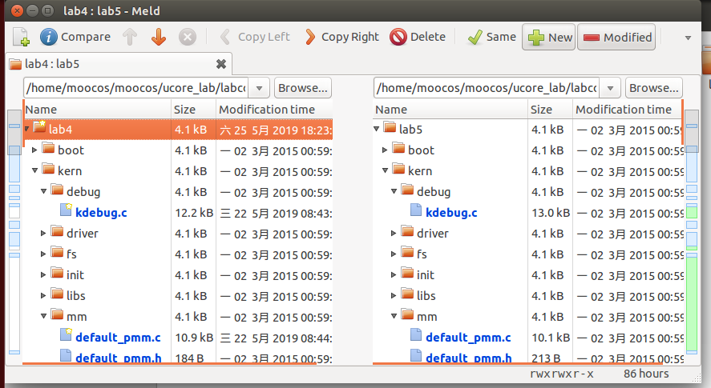
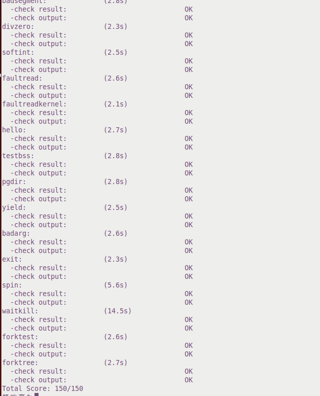

# lab5
## 【实验目的】
    •	了解第一个用户进程创建过程
    •	了解系统调用框架的实现机制
    •	了解ucore如何实现系统调用sys_fork/sys_exec/sys_exit/sys_wait来进行进程管理  

## 【实验要求】
    •	为了实现实验的目标，实验提供了3个基本练习和2个扩展练习，要求完成实验报告。
    •	练习0：填写已有实验
    •	练习1：加载应用程序并执行（需要编码）
    •	练习2：父进程复制自己的内存空间给子进程（需要编码）
    •	练习3：阅读分析源代码，理解进程执行 fork/exec/wait/exit 的实现，以及系统调用的实现（不需要编码）
    •	选做
    •	扩展练习Challenge： ：实现 Copy on Write （COW）机制  

## 【实验方案】
### **练习0**：  
**合并代码使用meld工具**:
 
对于有差别的文件进行Compare，填充代码。  
**代码修改**：
Lab5要求修改更新部分之前的代码  
**idt_init**：
```c
	extern uintptr_t __vectors[];	//声明中断入口 
	int i = 0;
	for (i = 0; i < (sizeof(idt) / sizeof(struct gatedesc)); i++) {
		SETGATE(idt[i], 0, GD_KTEXT, __vectors[i], DPL_KERNEL);//为中断设置内核态权限
	}
	SETGATE(idt[T_SYSCALL], 1, GD_KTEXT, __vectors[T_SYSCALL], DPL_USER);//为T_SYSCALL设置用户态权限
	lidt(&idt_pd);	//转入IDT
```
修改的代码为
```c  
SETGATE(idt[T_SYSCALL], 1, GD_KTEXT, __vectors[T_SYSCALL], DPL_USER);
```  
**trap_dispatch**:
```c
        ticks++;		//ticks自增
		if (ticks % TICK_NUM == 0) {
			//print_ticks();
			assert(current != NULL);
			current->need_resched = 1;
		}
```
修改的代码为：
```c
			assert(current != NULL);
			current->need_resched = 1;
```
作用是说明当前进程的时间片已用完，需要重新调度。print_ticks必须去掉，否则测试时会报错。  
**alloc_proc**:
```c
    proc->wait_state = 0;
    proc->cptr = NULL;
    proc->yptr = NULL;
    proc->optr = NULL;
```
作用主要有两点，一是设置进程为等待态，二是设置进程的兄弟父母节点为空。  
**do_fork**：
```c
    //list_add(&proc_list,&(proc->list_link));//insert proc_struct into hash_list && proc_list
    //nr_process++;
    set_links(proc);
```
作用是为proc建立联系并且插入proc_list，set_links是上面两句代码的改进版，因此上面的代码必须去掉，否则测试时会出错。
```c
static void
set_links(struct proc_struct* proc) {
	list_add(&proc_list, &(proc->list_link));
	proc->yptr = NULL;
	if ((proc->optr = proc->parent->cptr) != NULL) {
		proc->optr->yptr = proc;
	}
	proc->parent->cptr = proc;
	nr_process++;
}
```  
### **练习1**： 

    •	do_execv函数调用load_icode（位于kern/process/proc.c中）来加载并解析一个处于内存中的ELF执行文件格式的应用程序，建立相应的用户内存空间来放置应用程序的代码段、数据段等，且要设置好proc_struct结构中的成员变量trapframe中的内容，确保在执行此进程后，能够从应用程序设定的起始执行地址开始执行。需设置正确的trapframe内容。
    •	请在实验报告完成下面要求：
    •	简要说明你的设计实现过程。
    •	描述当创建一个用户态进程并加载了应用程序后，CPU是如何让这个应用程序最终在用户态执行起来的。即这个用户态进程被ucore选择占用CPU执行（RUNNING态）到具体执行应用程序第一条指令的整个经过。
	
（1）. 代码的填写过程比较简单，根据注释的内容给tf的成员赋值即可  
```c
	tf->tf_cs = USER_CS;
	tf->tf_ds = tf->tf_es = tf->tf_ss = USER_DS;
	tf->tf_esp = USTACKTOP;
	tf->tf_eip = elf->e_entry;
	tf->tf_eflags = FL_IF;
```
在lab4中已经学习过，trapframe类型的tf是中断帧的指针，而这部分代码的指针就是为中断帧赋新值，让CPU接下来能够转到用户态特权级，并回到用户态内存空间，使用用户态的代码段(USER_CS)、数据段(USER_DS)和堆栈(USTAKTOP) ，且能够跳转到用户进程的第一条指令执行(elf->e_entry)，并确保在用户态能够响应中断(FL_IF)。  
（2）. 要了解用户态进程被ucore选择占用CPU执行（RUNNING态）到具体执行应用程序第一条指令的整个经过首先需要了解load_icode的代码逻辑，load_icode的代码分段目的有关注释如下。   

    (1) create a new mm for current process
    (2) create a new PDT, and mm->pgdir= kernel virtual addr of PDT
    (3) copy TEXT/DATA section, build BSS parts in binary to memory space of process
    (3.1) get the file header of the bianry program (ELF format)
    (3.2) get the entry of the program section headers of the bianry program (ELF format)
    (3.3) This program is valid?
    (3.4) find every program section headers
    (3.5) call mm_map fun to setup the new vma ( ph->p_va, ph->p_memsz)
    (3.6) alloc memory, and  copy the contents of every program section (from, from+end) to process's memory (la, la+end)
    (3.6.1) copy TEXT/DATA section of bianry program
    (3.6.2) build BSS section of binary program
    (4) build user stack memory
    (5) set current process's mm, sr3, and set CR3 reg = physical addr of Page Directory
    (6) setup trapframe for user environment
这也就是用户态进程在load_icode经过的流程，学习实验手册后具体的流程如下：  

	1. 调用mm_create函数来申请进程的内存管理数据结构mm所需内存空间，并对mm进行初始化；
	2. 调用setup_pgdir来申请一个页目录表所需的一个页大小的内存空间，并把描述ucore内核虚空间映射的内核页表（boot_pgdir所指）的内容拷贝到此新目录表中，最后让mm->pgdir指向此页目录表，这就是进程新的页目录表了，且能够正确映射内核虚空间；
	3. 根据应用程序执行码的起始位置来解析此ELF格式的执行程序，并调用mm_map函数根据ELF格式的执行程序说明的各个段（代码段、数据段、BSS段等）的起始位置和大小建立对应的vma结构，并把vma插入到mm结构中，从而表明了用户进程的合法用户态虚拟地址空间；
	4. 调用根据执行程序各个段的大小分配物理内存空间，并根据执行程序各个段的起始位置确定虚拟地址，并在页表中建立好物理地址和虚拟地址的映射关系，然后把执行程序各个段的内容拷贝到相应的内核虚拟地址中，至此应用程序执行码和数据已经根据编译时设定地址放置到虚拟内存中了；
	5. 需要给用户进程设置用户栈，为此调用mm_mmap函数建立用户栈的vma结构，明确用户栈的位置在用户虚空间的顶端，大小为256个页，即1MB，并分配一定数量的物理内存且建立好栈的虚地址<-->物理地址映射关系；
	6. 至此,进程内的内存管理vma和mm数据结构已经建立完成，于是把mm->pgdir赋值到cr3寄存器中，即更新了用户进程的虚拟内存空间，此时的initproc已经被hello的代码和数据覆盖，成为了第一个用户进程，但此时这个用户进程的执行现场还没建立好；
	7. 先清空进程的中断帧，再重新设置进程的中断帧，使得在执行中断返回指令“iret”后，能够让CPU转到用户态特权级，并回到用户态内存空间，使用用户态的代码段、数据段和堆栈，且能够跳转到用户进程的第一条指令执行，并确保在用户态能够响应中断；

	这些已经为新进程的运行提供了足够的环境，但是还不完整，我们可以继续看do_execv函数的工作
```c
// do_execve - call exit_mmap(mm)&pug_pgdir(mm) to reclaim memory space of current process
//           - call load_icode to setup new memory space accroding binary prog.
```
因此可以看到，用户态进程从被选择到被执行需要两个过程，先要回收旧进程的空间，然后才能为新进程提供所需的环境，也就是do_execve调用exit_mmap(mm)& pug_pgdir(mm)与调用load_icode的两个过程。

### **练习2**:  

    •		创建子进程的函数do_fork在执行中将拷贝当前进程（即父进程）的用户内存地址空间中的合法内容到新进程中（子进程），完成内存资源的复制。具体是通过copy_range函数（位于kern/mm/pmm.c中）实现的，请补充copy_range的实现，确保能够正确执行。
    •	请在实验报告中简要说明如何设计实现”Copy on Write 机制“，给出概要设计，鼓励给出详细设计。
（1）. 填写代码需要用到两个新学到的函数page2kva和page_insert  
**page2kva**：
```c
static inline void*
page2kva(struct Page* page) {
	return KADDR(page2pa(page));
}
```
其作用是返回一个page的kernel vritual addr，返回值是void指针。  
**page_insert**：
```c
int
page_insert(pde_t * pgdir, struct Page* page, uintptr_t la, uint32_t perm) {
	pte_t* ptep = get_pte(pgdir, la, 1);
	if (ptep == NULL) {
		return -E_NO_MEM;
	}
	page_ref_inc(page);
	if (*ptep & PTE_P) {
		struct Page* p = pte2page(*ptep);
		if (p == page) {
			page_ref_dec(page);
		}
		else {
			page_remove_pte(pgdir, la, ptep);
		}
	}
	*ptep = page2pa(page) | PTE_P | perm;
	tlb_invalidate(pgdir, la);
	return 0;
}
```
学习了这两个函数后就可以根据注释编写代码了。
```c
	void* src_kvaddr = page2kva(page);
	void* dst_kvaddr = page2kva(npage);
	memcpy(dst_kvaddr, src_kvaddr, PGSIZE);
	ret = page_insert(to, npage, start, perm);
```
其原理是用memcpy将父进程的内核虚地址里的值复制给子进程的内核虚地址的空间。  

（2）. 创建子进程的时候不是将父进程的内存复制一份给子进程，而是将父进程的PDE复制给子进程，但是不允许子进程写入。当子进程请求写操作时，再给子进程分配一块空间，并替换其PDE中的项，才可以执行写操作。  

### **练习3**：  

    •	请在实验报告中简要说明你对 fork/exec/wait/exit函数的分析。并回答如下问题：
    •	请分析fork/exec/wait/exit在实现中是如何影响进程的执行状态的？
    •	请给出ucore中一个用户态进程的执行状态生命周期图（包执行状态，执行状态之间的变换关系，以及产生变换的事件或函数调用）。（字符方式画即可）
（1）. fork/exec/wait/exit对应的函数分别为do_fork, do_execve, do_wait, do_exit，接下来会根据这四个函数来进行分析。  
**代码学习**：  
**do_fork**:
```c
do_fork -     parent process for a new child process
 * @clone_flags: used to guide how to clone the child process
 * @stack:       the parent's user stack pointer. if stack==0, It means to fork a kernel thread.
 * @tf:          the trapframe info, which will be copied to child process's proc->tf
 */
int
do_fork(uint32_t clone_flags, uintptr_t stack, struct trapframe* tf) {
	int ret = -E_NO_FREE_PROC;
	struct proc_struct* proc;
	if (nr_process >= MAX_PROCESS) {
		goto fork_out;
	}
	ret = -E_NO_MEM;
	proc = alloc_proc();                  //call alloc_proc to allocate a proc_struct
	assert(proc->wait_state == 0);
	if (setup_kstack(proc) != 0)             //setup_kstack to allocate a kernel stack for child process 
		goto bad_fork_cleanup_proc;
	if (copy_mm(clone_flags, proc) != 0)     //call copy_mm to dup OR share mm according clone_flag
		goto bad_fork_cleanup_kstack;
	copy_thread(proc, stack, tf);         //call copy_thread to setup tf & context in proc_struct
	proc->parent = current;
	bool intr_flag;
	local_intr_save(intr_flag);
	{
		proc->pid = get_pid();
		hash_proc(proc);
		//list_add(&proc_list,&(proc->list_link));//insert proc_struct into hash_list && proc_list
		//nr_process++;
		set_links(proc);
	}
	local_intr_restore(intr_flag);        //call wakup_proc to make the new child process RUNNABLE
	wakeup_proc(proc);
	ret = proc->pid;                      //set ret vaule using child proc's pid
fork_out:
	return ret;

bad_fork_cleanup_kstack:
	put_kstack(proc);
bad_fork_cleanup_proc:
	kfree(proc);
	goto fork_out;
}
```
do_fork是lab4中的一项练习，在实验手册中学习并结合代码总结do_fork的主要工作为：  

	1、调用alloc_proc，首先获得一块用户信息块。
	2、调用setup_kstack为进程分配一个内核栈。
	3、调用copy_mm复制原进程的内存管理信息到新进程（但内核线程不必做此事）
	4、调用copy_thread复制原进程上下文到新进程
	5、调用hash_proc和set_links将新进程添加到进程列表hash_list和proc_list中
	6、调用wakeup_proc唤醒新进程
	7、返回新进程号ret(proc->id)
**do_execve**:  
```c
// do_execve - call exit_mmap(mm)&pug_pgdir(mm) to reclaim memory space of current process
//           - call load_icode to setup new memory space accroding binary prog.
int
do_execve(const char* name, size_t len, unsigned char* binary, size_t size) {
	struct mm_struct* mm = current->mm;
	if (!user_mem_check(mm, (uintptr_t)name, len, 0)) {
		return -E_INVAL;
	}
	if (len > PROC_NAME_LEN) {
		len = PROC_NAME_LEN;
	}

	char local_name[PROC_NAME_LEN + 1];
	memset(local_name, 0, sizeof(local_name));
	memcpy(local_name, name, len);

	if (mm != NULL) {
		lcr3(boot_cr3);
		if (mm_count_dec(mm) == 0) {
			exit_mmap(mm);
			put_pgdir(mm);
			mm_destroy(mm);
		}
		current->mm = NULL;
	}
	int ret;
	if ((ret = load_icode(binary, size)) != 0) {
		goto execve_exit;
	}
	set_proc_name(current, local_name);
	return 0;

execve_exit:
	do_exit(ret);
	panic("already exit: %e.\n", ret);
}
```
学习实验手册与分析代码，可以找到do_execve的工作如下：  

	1. 首先为加载新的执行码做好用户态内存空间清空准备。如果mm不为NULL，则设置页表为内核空间页表，且进一步判断mm的引用计数减1后是否为0，如果为0，则表明没有进程再需要此进程所占用的内存空间，为此将根据mm中的记录，释放进程所占用户空间内存和进程页表本身所占空间。最后把当前进程的mm内存管理指针为空。由于此处的initproc是内核线程，所以mm为NULL，整个处理都不会做。
	2. 接下来的一步是加载应用程序执行码到当前进程的新创建的用户态虚拟空间中。这里涉及到读ELF格式的文件，申请内存空间，建立用户态虚存空间，加载应用程序执行码等。load_icode函数完成了整个复杂的工作。
**do_wait**  
```c
// do_wait - wait one OR any children with PROC_ZOMBIE state, and free memory space of kernel stack
//         - proc struct of this child.
// NOTE: only after do_wait function, all resources of the child proces are free.
int
do_wait(int pid, int* code_store) {
	struct mm_struct* mm = current->mm;
	if (code_store != NULL) {
		if (!user_mem_check(mm, (uintptr_t)code_store, sizeof(int), 1)) {
			return -E_INVAL;
		}
	}

	struct proc_struct* proc;
	bool intr_flag, haskid;
repeat:
	haskid = 0;
	if (pid != 0) {
		proc = find_proc(pid);
		if (proc != NULL && proc->parent == current) {
			haskid = 1;
			if (proc->state == PROC_ZOMBIE) {
				goto found;
			}
		}
	}
	else {
		proc = current->cptr;
		for (; proc != NULL; proc = proc->optr) {
			haskid = 1;
			if (proc->state == PROC_ZOMBIE) {
				goto found;
			}
		}
	}
	if (haskid) {
		current->state = PROC_SLEEPING;
		current->wait_state = WT_CHILD;
		schedule();
		if (current->flags & PF_EXITING) {
			do_exit(-E_KILLED);
		}
		goto repeat;
	}
	return -E_BAD_PROC;

found:
	if (proc == idleproc || proc == initproc) {
		panic("wait idleproc or initproc.\n");
	}
	if (code_store != NULL) {
		*code_store = proc->exit_code;
	}
	local_intr_save(intr_flag);
	{
		unhash_proc(proc);
		remove_links(proc);
	}
	local_intr_restore(intr_flag);
	put_kstack(proc);
	kfree(proc);
	return 0;
}
```
同样在实验手册上学习到其工作流程：
	1. 如果pid!=0，表示只找一个进程id号为pid的退出状态的子进程，否则找任意一个处于退出状态的子进程；
	2. 如果此子进程的执行状态不为PROC_ZOMBIE，表明此子进程还没有退出，则当前进程只好设置自己的执行状态为PROC_SLEEPING，睡眠原因为WT_CHILD（即等待子进程退出），调用schedule()函数选择新的进程执行，自己睡眠等待，如果被唤醒，则重复跳回步骤1处执行；
	3. 如果此子进程的执行状态为PROC_ZOMBIE，表明此子进程处于退出状态，需要当前进程（即子进程的父进程）完成对子进程的最终回收工作，即首先把子进程控制块从两个进程队列proc_list和hash_list中删除，并释放子进程的内核堆栈和进程控制块。自此，子进程才彻底地结束了它的执行过程，消除了它所占用的所有资源。
**do_exit**:  
```c
// do_exit - called by sys_exit
//   1. call exit_mmap & put_pgdir & mm_destroy to free the almost all memory space of process
//   2. set process' state as PROC_ZOMBIE, then call wakeup_proc(parent) to ask parent reclaim itself.
//   3. call scheduler to switch to other process
int
do_exit(int error_code) {
	if (current == idleproc) {
		panic("idleproc exit.\n");
	}
	if (current == initproc) {
		panic("initproc exit.\n");
	}

	struct mm_struct* mm = current->mm;
	if (mm != NULL) {
		lcr3(boot_cr3);
		if (mm_count_dec(mm) == 0) {
			exit_mmap(mm);
			put_pgdir(mm);
			mm_destroy(mm);
		}
		current->mm = NULL;
	}
	current->state = PROC_ZOMBIE;
	current->exit_code = error_code;

	bool intr_flag;
	struct proc_struct* proc;
	local_intr_save(intr_flag);
	{
		proc = current->parent;
		if (proc->wait_state == WT_CHILD) {
			wakeup_proc(proc);
		}
		while (current->cptr != NULL) {
			proc = current->cptr;
			current->cptr = proc->optr;

			proc->yptr = NULL;
			if ((proc->optr = initproc->cptr) != NULL) {
				initproc->cptr->yptr = proc;
			}
			proc->parent = initproc;
			initproc->cptr = proc;
			if (proc->state == PROC_ZOMBIE) {
				if (initproc->wait_state == WT_CHILD) {
					wakeup_proc(initproc);
				}
			}
		}
	}
	local_intr_restore(intr_flag);

	schedule();
	panic("do_exit will not return!! %d.\n", current->pid);
}
```
实验册上对其工作的总结为：  

	1. 如果current->mm != NULL，表示是用户进程，则开始回收此用户进程所占用的用户态虚拟内存空间；
	2. 这时，设置当前进程的执行状态current->state=PROC_ZOMBIE，当前进程的退出码current->exit_code=error_code。此时当前进程已经不能被调度了，需要此进程的父进程来做最后的回收工作（即回收描述此进程的内核栈和进程控制块）；
	3. 如果当前进程的父进程current->parent处于等待子进程状态：current->parent->wait_state==WT_CHILD，则唤醒父进程（即执行“wakup_proc(current->parent)”），让父进程帮助自己完成最后的资源回收；
	4. 如果当前进程还有子进程，则需要把这些子进程的父进程指针设置为内核线程initproc，且各个子进程指针需要插入到initproc的子进程链表中。如果某个子进程的执行状态是PROC_ZOMBIE，则需要唤醒initproc来完成对此子进程的最后回收工作。
	5. 执行schedule()函数，选择新的进程执行。
**总结**：  
通过对实验手册和代码的学习，可以总结出fork/exec/wait/exit对进程状态的影响。  

	1. fork: 创建成功后存在父进程和子进程两个进程，其中子进程会被设置为就绪状态，而父进程继续执行。
	2. exec: 回收旧进程的空间并为新进程准备执行环境，然后加载应用程序执行码到当前进程的新创建的用户态虚拟空间中使之准备进行。
	3. wait: 当前进程需要等待子进程的结束通知。若子进程未结束，则当前进程睡眠，并让其他进程继续执行，当子进程将要结束时，当前进程会回收子进程的资源并让其结束。
	4. exit: 当前进程将被结束并回收，并通知父进程来做最后的回收工作，若父进程正因为等待而沉睡，则唤醒父进程。如果当前进程还有子进程，则需要把这些子进程的父进程指针设置为内核线程initproc，且各个子进程指针需要插入到initproc的子进程链表中。  

（2）
 
## 【实验过程】  
使用到的代码编写工具为sublime-text3，实验环境为ubuntu14，实验报告代码格式使用Visual Studio 2019.  
实验结果:
 
